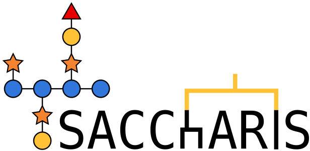

#SACCHARIS 2.0

Sequence Analysis and Clustering of CarboHydrate Active enzymes for Rapid Informed 
prediction of Specificity (SACCHARIS), is a python based pipeline designed to improve 
functional predictions of uncharacterized sequences for any CAZyme or CBM family 
currently maintained on the CAZy website or within user-defined datasets through
phylogenetic methods.

## Beta information

SACCHARIS 2.0 is currently under active development and is currently in closed beta. 
Public release will be available through the bioconda channel of the conda package manager 
fall 2022. If you would like to participate in the beta, please contact us.

## Citation

[//]: # (todo: update this to new paper when it's published?)
Publication information coming soon.

##Installation

### Beta installation

Run the linux_install script to set up the virtual environment, or run 
``conda install --use-local /path/to/conda_package.tar.gz``

[//]: # (###Installation option 1: Conda Install)

[//]: # (This is the preferred method for most users, since installation should be simple.)

[//]: # ()
[//]: # (First make sure you have installed conda. I recommend downloading a version appropriate to your OS from https://www.anaconda.com/products/distribution#Downloads)

[//]: # ()
[//]: # (Then you can download and install SACCHARIS with:)

[//]: # ()
[//]: # (``conda install saccharis``)

[//]: # ()
[//]: # (This will attempt to automatically download and install all dependencies as well as SACCHARIS itself.)

[//]: # (It will be automatically installed in the currently active conda environment. You can install it in the base environment, or on a dedicated envrionment for SACCHARIS.)

[//]: # ()
[//]: # (You can learn more about using the conda package manager and virtual environments here:)

[//]: # (https://docs.conda.io/projects/conda/en/latest/user-guide/getting-started.html)

[//]: # ()
[//]: # (###Installation option 2: Script installation to a virtual environment on a linux system)

[//]: # ()
[//]: # (If you have problems with the standard conda package install, you can use the environment.yaml file and the install_linux.sh script from this github repository to set up a virtual environment with the known working dependency versions.)

[//]: # ()
[//]: # (First make sure you have installed conda. I recommend downloading a version appropriate to your OS from https://www.anaconda.com/products/distribution#Downloads)

[//]: # ()
[//]: # (Then you can simply run "install_linux.sh". This will automatically download and install dependencies to a virtual environment for SACCHARIS 2 using conda.)

[//]: # (Once installed, it activates the "saccharis_env" virtual environment, from which you can use saccharis right away.)

[//]: # ()
[//]: # (In the future, when starting a new shell, you will need to activate the saccharis_env envrionment before you can use saccharis.)

[//]: # (The default command for this is: "conda activate saccharis_env")

[//]: # ()
[//]: # (You can learn more about using the conda package manager and virtual environments here:)

[//]: # (https://docs.conda.io/projects/conda/en/latest/user-guide/getting-started.html)

[//]: # ()
[//]: # (###Installation option 3: Manually install requirements and python package)

[//]: # (This is an advanced method of installing SACCHARIS that is not recommended for most users. I would not recommend this unless you )

[//]: # (are installing in an environment that does not support conda package and environment management, such as a computing cluster. )

[//]: # ()
[//]: # (If you would prefer to install and manage dependencies through another method than the conda environment, this is the explicit)

[//]: # (list of requirements SACCHARIS 2 needs to function.)

[//]: # (All of the following programs installed and available on $PATH variable:)

[//]: # (* Python 3.10 with following python libraries:)

[//]: # (  * beautifulsoup4 v4.11.1)

[//]: # (  * biopython v1.79)

[//]: # (  * requests v2.28.0)

[//]: # (  * wget v1.20.3)

[//]: # (  * run_dbcan v3.0.6)

[//]: # (* DIAMOND  v2.0.15)

[//]: # (* HMMER v3.3)

[//]: # (* MUSCLE v5 or v3.8.1551)

[//]: # (* ModelTest)

[//]: # (* FastTree v2.1.11)

[//]: # (* RAxML version 8.2.12)

[//]: # ()
[//]: # (Other versions of the above software may work, but have not been tested extensively.)

[//]: # ()
[//]: # (After installing the above dependencies, you can directly install the python package tarball with pip.)

# Running SACCHARIS
###GUI
You can launch the gui from the command line via `saccharis-gui` or it can be launched from the anaconda navigator 
(if navigator is installed).

[//]: # (todo: add start menu and/or desktop shortcuts to gui install?)

###CLI
In terminal follow usage as given by
  - `saccharis -h` or `saccharis --help`

[//]: # (# License)

  [//]: # (todo: choose a license, are we still using GPL? Update to GPL 3?)

  [//]: # (This software is distributed under the terms of the GPL, version 2 or later, excepting that:)

  [//]: # (- The third party programs and scripts used by SACCHARIS are covered by the terms of their respective licenses)

